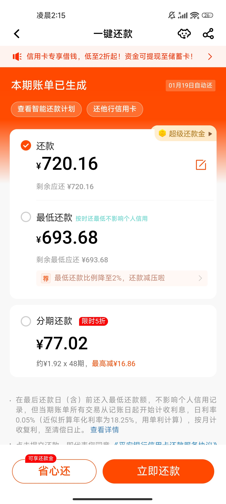
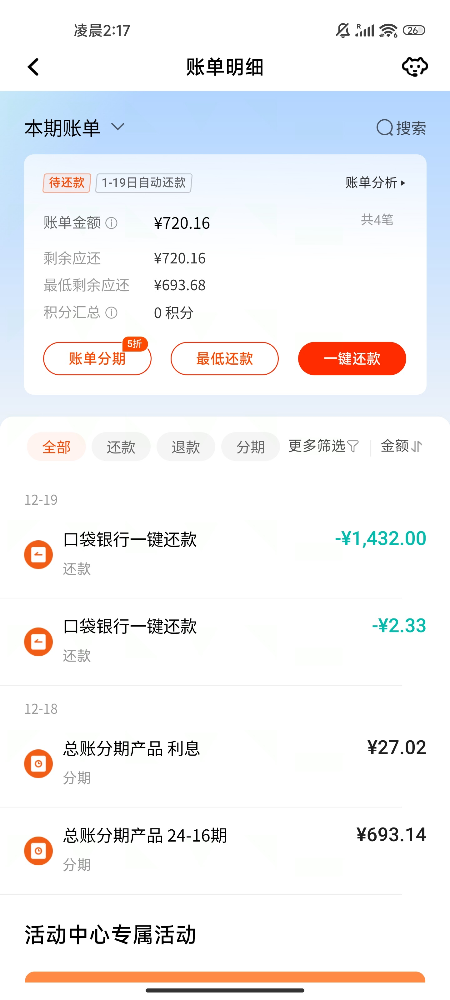
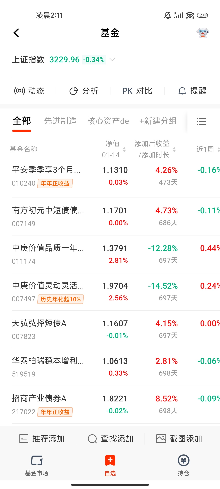
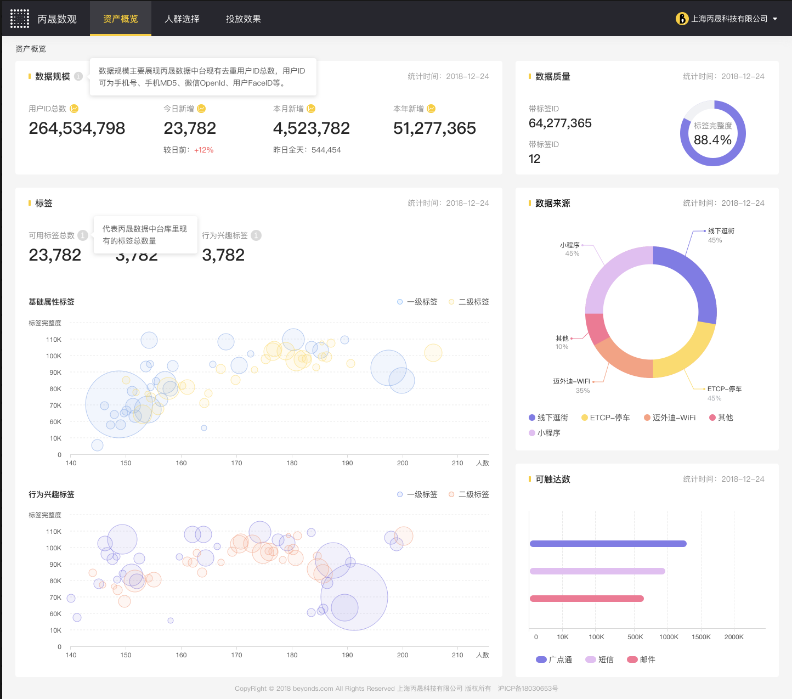
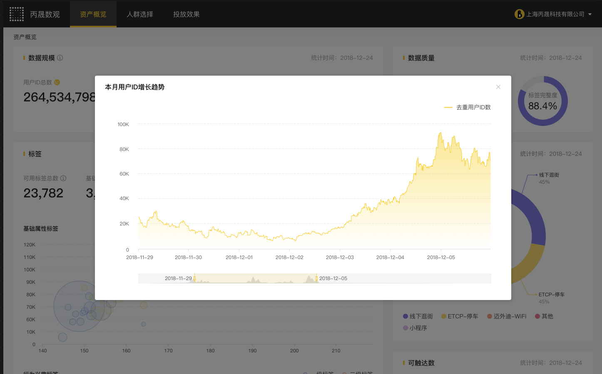
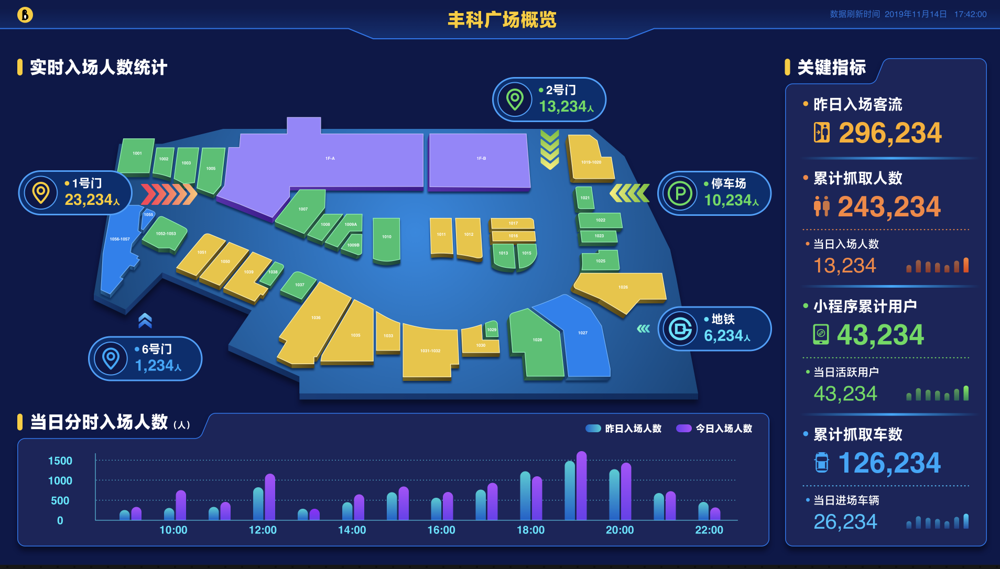
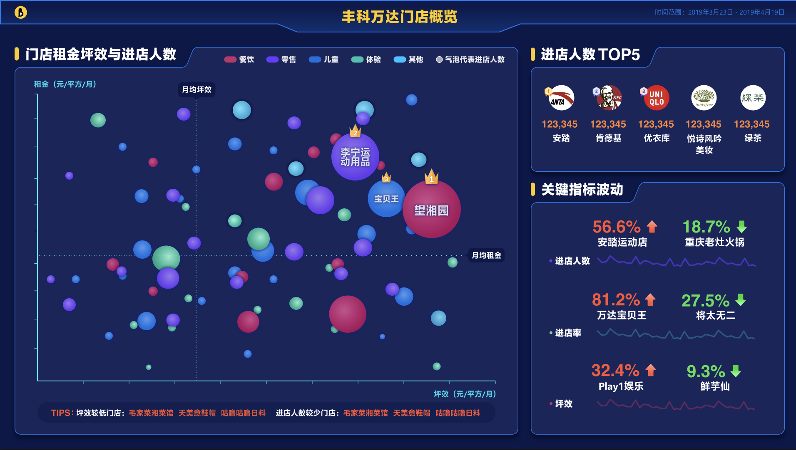

# My Projects Showcase 🎉

## Project 1: Repayment function for credit card in PINGAN bank
Description: Regarding repayment, although the page may appear simple, it contains a lot of internal logic. For example, the user interface adapts to different user types, such as those using dual-currency credit cards. Additionally, based on the user's repayment time, the system guides them to set up a repayment plan and receive repayment discounts. Due to the involvement of fund transfers, the server-side requires strict validation.

## Project 2: Bill function for credit card in PINGAN bank
Description: The bill page displays the bill date along with detailed billing information, such as the date, amount, discounts, and bill type. Users can filter by time periods to view specific bills.

## Project 3: Fund function for credit card in PINGAN bank
Description: For the large wealth fund project, React Native technology was used along with better page interaction design compared to Alipay, aiming to provide users with an improved experience. For instance, the waiting time on the user interface is negligible.

## Project 4: Wanda Plaza Admin Panel
Description: Vue2 was used to develop the PC backend management system for Wanda Plaza, helping operators reference data and implement corresponding operational strategies. For example, line charts provide an intuitive representation of Wanda Plaza’s operational performance.

## Project 4: Real-Time Data Dashboard
Description: Echarts, Highcharts, and other tools were used for visual chart development, showcasing digital marketing data for over 200 Wanda Plaza locations on a 75-inch screen. The focus was on optimizing the first-screen rendering load time, as well as real-time chart updates to help managers monitor traffic and sales figures at the plazas.
  

 
